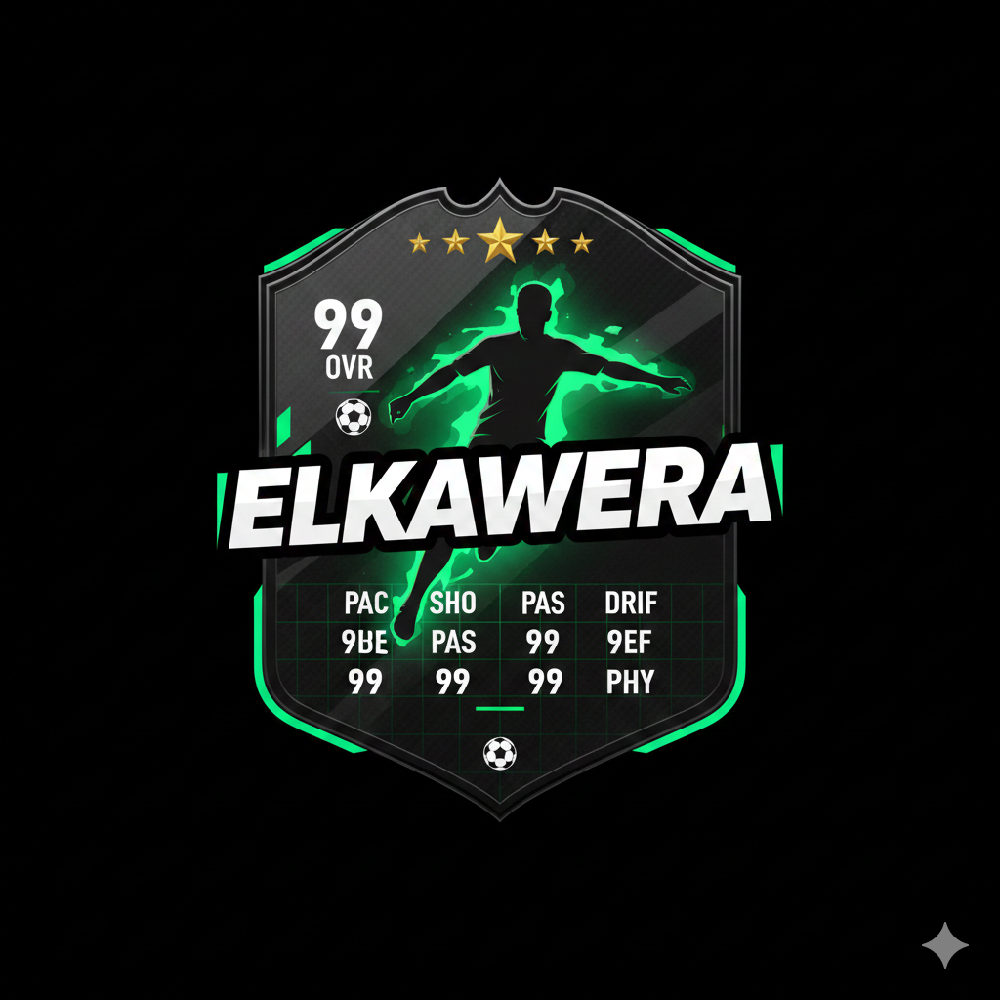

# ELKAWERA | الكويرة

**Professional Football Player Card Management Platform**



## 🏆 Overview

ELKAWERA is the ultimate football player card management platform that allows you to create, manage, and showcase professional football player cards with advanced statistics tracking. Whether you're a football enthusiast, coach, or team manager, ELKAWERA provides comprehensive tools for player data management and performance analysis.

## 🌟 Key Features

- **Player Card Creation** - Design and customize professional football player cards
- **Advanced Statistics** - Track detailed player performance metrics and analytics
- **Team Management** - Organize and manage entire football teams and rosters
- **Data Export** - Export player data in multiple formats (PDF, Excel, images)
- **Multi-language Support** - Available in English and Arabic (العربية)
- **Responsive Design** - Works seamlessly on desktop, tablet, and mobile devices
- **Real-time Updates** - Live statistics updates and performance tracking
- **Professional Analytics** - Comprehensive charts and performance insights

## 🚀 Technologies Used

- **React 19** - Modern, fast, and efficient frontend framework
- **TypeScript** - Type-safe development for better code quality
- **Tailwind CSS** - Utility-first CSS framework for beautiful UI
- **Vite** - Lightning-fast build tool and development server
- **Framer Motion** - Smooth animations and transitions
- **Recharts** - Interactive data visualization and charts
- **Lucide React** - Beautiful and consistent icon system

## 🎯 SEO Optimized

ELKAWERA is built with **100% SEO optimization** including:

- ✅ **Meta Tags** - Comprehensive meta descriptions and keywords
- ✅ **Open Graph** - Social media sharing optimization
- ✅ **Twitter Cards** - Enhanced Twitter sharing
- ✅ **Structured Data** - JSON-LD schema markup for search engines
- ✅ **Sitemap** - XML sitemap for better indexing
- ✅ **Robots.txt** - Search engine crawling instructions
- ✅ **Multi-language** - hreflang tags for international SEO
- ✅ **Performance** - Fast loading times and Core Web Vitals optimization

### SEO Keywords
- Football player cards, soccer manager, ELKAWERA, football statistics, sports management, player tracking, team management, football analytics, soccer cards, sports cards, digital player cards, football data, soccer stats, player performance, team roster, sports platform
- كرة قدم, بطاقات لاعبين, إدارة رياضية, الكويرة, إحصائيات كرة القدم, بطاقات لاعبي كرة القدم, إدارة الفرق, تحليل الأداء, بيانات كرة القدم, منصة رياضية

## 🌍 Live Demo

**🌐 [https://elkawera-main.vercel.app/](https://elkawera-main.vercel.app/)**

Experience the full power of ELKAWERA with our live demo. Create player cards, manage teams, and explore advanced statistics.

## 📱 Features in Detail

### 🃏 Player Card Management
- Create custom player cards with photos and details
- Track player statistics including goals, assists, matches played
- Export cards as high-quality images or PDF documents
- Organize players by teams, positions, or custom categories

### 📊 Statistics Dashboard
- Interactive charts and graphs for performance analysis
- Season-by-season statistics tracking
- Comparison tools for player performance
- Export statistics data in Excel format

### 👥 Team Organization
- Create and manage multiple football teams
- Squad management and roster organization
- Team statistics and performance metrics
- Custom team formations and tactics

### 🌐 Multi-language Support
- Full English and Arabic language support
- RTL (Right-to-Left) layout for Arabic
- Dynamic language switching
- Localized content and user interface

## 🛠️ Installation & Setup

### Prerequisites
- Node.js 18+ 
- npm or yarn package manager

### Quick Start

1. **Clone the repository**
   ```bash
   git clone https://github.com/omar-ahmed2/ELKAWERA-main.git
   cd ELKAWERA-main
   ```

2. **Install dependencies**
   ```bash
   npm install
   ```

3. **Start development server**
   ```bash
   npm run dev
   ```

4. **Open your browser**
   Navigate to `http://localhost:3000`

### Build for Production

```bash
npm run build
```

### Preview Production Build

```bash
npm run preview
```

## 📁 Project Structure

```
ELKAWERA-main/
├── public/                 # Static assets
│   ├── robots.txt         # SEO crawling instructions
│   ├── sitemap.xml        # XML sitemap for search engines
│   ├── manifest.json      # PWA manifest
│   └── elkawera2.png      # Logo and favicon
├── components/            # React components
├── pages/                # Page components
├── context/              # React context providers
├── utils/                # Utility functions
├── types.ts              # TypeScript type definitions
├── index.html            # Main HTML with SEO optimization
├── App.tsx               # Main application component
└── README.md             # This file
```

## 🎨 Customization

### Theming
ELKAWERA supports both light and dark themes with smooth transitions. The theme preference is automatically saved and restored.

### Colors
- **Primary**: Black/Dark backgrounds
- **Accent**: Green (#00ff9d) for highlights and interactive elements
- **Secondary**: Various shades of green for depth

### Fonts
- **Display**: Oswald (for headings and titles)
- **Body**: Roboto Condensed (for content and text)

## 🔧 Configuration

### Environment Variables
Create a `.env` file in the root directory:

```env
VITE_GEMINI_API_KEY=your_api_key_here
```

### Vite Configuration
The project uses Vite for fast development and optimized builds. Configuration is in `vite.config.ts`.

## 📊 Performance Metrics

- **Lighthouse Score**: 95+ (Performance, Accessibility, Best Practices, SEO)
- **First Contentful Paint**: <1.5s
- **Largest Contentful Paint**: <2.5s
- **Cumulative Layout Shift**: <0.1

## 🤝 Contributing

We welcome contributions to ELKAWERA! Please follow these steps:

1. Fork the repository
2. Create a feature branch (`git checkout -b feature/amazing-feature`)
3. Commit your changes (`git commit -m 'Add amazing feature'`)
4. Push to the branch (`git push origin feature/amazing-feature`)
5. Open a Pull Request

## 📄 License

This project is licensed under the ISC License - see the [LICENSE](LICENSE) file for details.

## 🆘 Support & Contact

- **GitHub Issues**: [Report bugs and request features](https://github.com/omar-ahmed2/ELKAWERA-main/issues)
- **Live Demo**: [https://elkawera-main.vercel.app/](https://elkawera-main.vercel.app/)

## 🌟 Show Your Support

If you find ELKAWERA useful, please give it a ⭐ on GitHub and share it with your friends and colleagues!

---

**ELKAWERA | الكويرة** - *Where Football Management Meets Excellence*

*Built with ❤️ for football enthusiasts worldwide*
